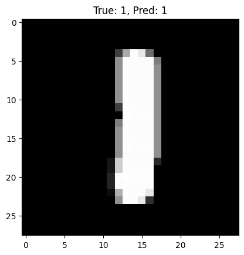
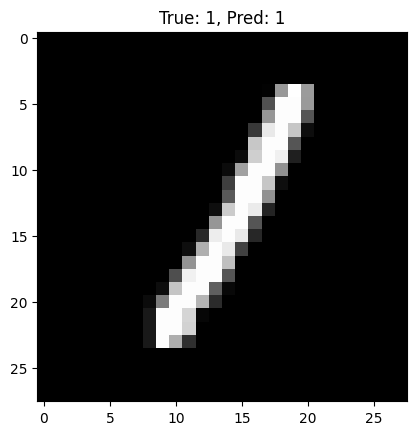
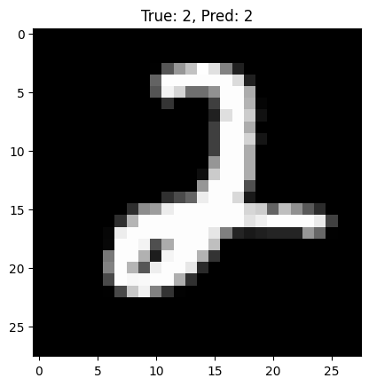
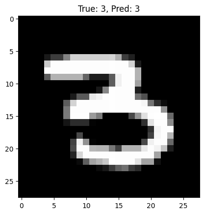
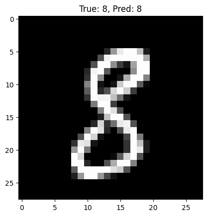

# AI Toolkit Practical

## Overview

**AI Toolkit Practical** is a hands-on exploration of essential AI tools, emphasizing **practical implementation** and **rapid experimentation** using classic datasets.  
This project demonstrates the use of **scikit-learn**, **TensorFlow**, and **spaCy** for:

- Supervised machine learning
- Deep learning (CNN)
- Natural language processing (NLP)

It aligns with educational assignment requirements while serving as a compact, reproducible AI learning toolkit.

---

## Directory Structure

```
ai-toolkit-practical/
├── image-output/ # Sample output images from MNIST CNN predictions
├── mnist_tensorflow.ipynb # Deep learning (TensorFlow/Keras, MNIST)
├── ner_spacy.ipynb # NLP demo (spaCy, Amazon Reviews)
├── scikit-learn.ipynb # Classical ML (scikit-learn, Iris)
└── theory.docx # Theory/report answers
```

---

## Quick Start

### 1. Clone the Repository

```bash
git clone https://github.com/111morris/ai-toolkit-practical.git
cd ai-toolkit-practical
```

### 2. Dependencies

Python 3.8+ (tested on Google Colab and Jupyter Notebook)

Required packages:

```bash
scikit-learn
tensorflow
spacy
matplotlib
numpy
```

- To install dependencies:

```bash
pip install scikit-learn tensorflow spacy matplotlib numpy
```

- For spaCy, download the English language model

```bash
python -m spacy download en_core_web_sm
```

### 3. Run the Notebooks

Open any .ipynb file in Jupyter Notebook or Google Colab.
Each notebook is self-contained with clear comments explaining the workflow.

| Task          | Dataset                    | Source                            |
| ------------- | -------------------------- | --------------------------------- |
| Classical ML  | **Iris Dataset**           | [Kaggle](https://www.kaggle.com/) |
| Deep Learning | **MNIST**                  | TensorFlow Datasets               |
| NLP           | **Amazon Product Reviews** | [Kaggle](https://www.kaggle.com/) |

Sample CNN output images are available in the /image-output/ directory.







Tasks Covered
🔹 scikit-learn

Decision Tree Classification on Iris dataset

Model evaluation metrics (accuracy, confusion matrix, etc.)

🔹 TensorFlow

Convolutional Neural Network (CNN) for MNIST digit classification

Achieved >95% accuracy

Sample prediction results saved as images

🔹 spaCy

Named Entity Recognition (NER) on Amazon-style reviews

Simple rule-based sentiment analysis demo

## Output

Visuals: CNN result plots and prediction images → image-output/

Results: All model predictions and metrics are viewable directly inside the Jupyter notebooks.

## License

This project is for educational and demonstration purposes only.
Datasets are sourced from Kaggle and TensorFlow Datasets and are subject to their respective licenses.

Author: Morris Mulandi
GitHub: @111morris
